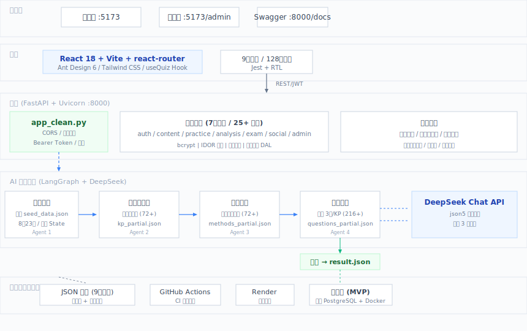

# 🎓 教育学习系统 (Edu Agent System)

<p align="center">
  <a href="https://www.python.org/"></a>
  <a href="https://fastapi.tiangolo.com/"></a>
  <a href="https://react.dev/"></a>
  <a href="https://vitejs.dev/"></a>
  <a href="https://langchain.com/langgraph"></a>
  <a href="https://deepseek.com/"></a>
  <a href="https://ant.design/"></a>
  <a href="https://tailwindcss.com/"></a>
  <a href="https://jestjs.io/"></a>
  <a href="#"></a>
  <a href="#"></a>
</p>

基于 AI Agent 的初中数学学习系统，利用 LangGraph 多 Agent 编排 + DeepSeek API，自动从教材中提取知识点、生成学习方法卡片和智能题库。

## ✨ 功能

- **知识点提取** — AI 自动从教材章节中提取结构化的知识点
- **学习方法卡片** — 为每个知识点生成对应的高效学习方法
- **智能出题** — 每个知识点自动生成 3 道不同难度的题目
- **学生端** — 章节选择 → 刷题 → 实时对错反馈 → 解析查看 → 错题本
- **管理台** — 章节管理、题库浏览、知识点管理

## 🏗️ 系统架构



### 架构分层

| 层 | 技术 | 说明 |
|---|---|---|
| 🖥️ **前端层** | React 18 + Vite + Ant Design 6 + Tailwind CSS | SPA 应用，9 个页面，useQuiz 状态机驱动刷题 |
| ⚙️ **后端层** | FastAPI + Uvicorn + bcrypt | 7 个路由模块，25+ API 端点，Bearer Token 认证 |
| 💾 **数据层** | JSON 文件 + 线程锁 + 原子写入 | 9 个独立数据文件，MVP 阶段，计划迁移 PostgreSQL |
| 🤖 **AI 管道** | LangGraph StateGraph + DeepSeek API | 4 Agent 线性流水线：注入→提取→方法→出题 |
| 🚀 **部署** | GitHub Actions + Render | CI 双端测试 + 一键云端部署 |

### Agent 流水线

```
seed_injector → knowledge_extractor → learning_method → question_generator → summary
 (注入章节)       (提取知识点)           (生成方法卡片)     (智能出题×3)       (汇总保存)
      ↓                ↓                     ↓                 ↓
  State 内存      kp_partial.json     methods_partial.json  questions_partial.json
                                                              (逐KP增量追加)
```

## 🚀 快速启动

```bash
# 1. 配置 API 密钥（在 edu_mvp/.env 中填入）
# DEEPSEEK_API_KEY=sk-xxxxx

# 2. 生成数据
cd edu_mvp && python mvp_main.py

# 3. 一键启动
bash edu_mvp/start_all.sh
```

## 📱 访问地址

| 服务 | 地址 |
|------|------|
| 学生端 | http://localhost:5173 |
| 管理台 | http://localhost:5173/admin |
| API 文档 | http://localhost:8000/docs |
| 后端 API | http://localhost:8000 |

## 🛠 技术栈

| 层 | 技术组件 | 用途 |
|---|---|---|
| **AI Agent** |    | 4 Agent 编排、LLM 调用、非标准 JSON 容错 |
| **后端** |    | REST API、认证鉴权、业务逻辑 |
| **安全** |   | 密码加密、会话管理、IDOR 防护、限流 |
| **前端** |      | SPA 应用、组件库、路由 |
| **测试** |    | 前端 128 用例全部通过 |
| **CI/CD** |   | 双端自动测试 + 一键部署 |

## 📊 开发进度

详见 [edu_mvp/TODO.md](edu_mvp/TODO.md)

当前阶段：Phase 1 — 完善 MVP 基础（前后端联调 ✅ / 扩展章节 ✅ / 错题本持久化 ⬜）

## 📁 项目结构

```
edu_mvp/
├── mvp_main.py         # AI 数据生成主程序（4 Agent 编排）
├── backend/            # FastAPI 后端（端口 8000）
├── frontend/           # React 前端（端口 5173）
├── data/               # 教材种子数据
├── output/             # AI 生成结果
├── start_all.sh        # 一键启动脚本
└── stop_all.sh         # 一键停止脚本
```
